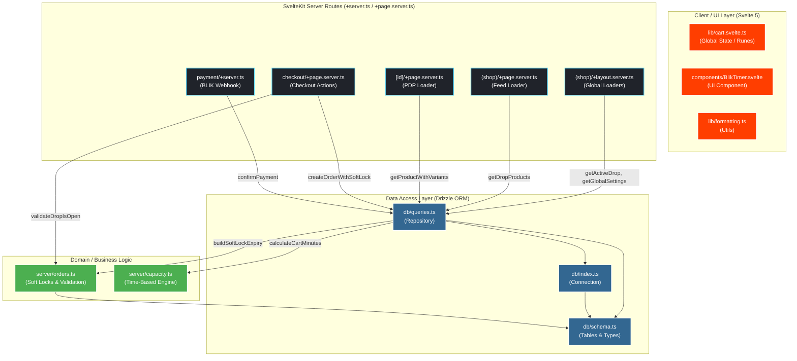

```mermaid
flowchart TD
    %% Styling
    classDef svelte fill:#ff3e00,stroke:#fff,stroke-width:2px,color:#fff;
    classDef server fill:#20232a,stroke:#61dafb,stroke-width:2px,color:#fff;
    classDef domain fill:#4caf50,stroke:#fff,stroke-width:2px,color:#fff;
    classDef db fill:#336791,stroke:#fff,stroke-width:2px,color:#fff;

    subgraph ClientLayer ["Client / UI Layer (Svelte 5)"]
        Cart["lib/cart.svelte.ts<br/>(Global State / Runes)"]:::svelte
        BlikTimer["components/BlikTimer.svelte<br/>(UI Component)"]:::svelte
        Format["lib/formatting.ts<br/>(Utils)"]:::svelte
    end

    subgraph RouteLayer ["SvelteKit Server Routes (+server.ts / +page.server.ts)"]
        ShopLayout["(shop)/+layout.server.ts<br/>(Global Loaders)"]:::server
        ShopPage["(shop)/+page.server.ts<br/>(Feed Loader)"]:::server
        IdPage["[id]/+page.server.ts<br/>(PDP Loader)"]:::server
        CheckoutPage["checkout/+page.server.ts<br/>(Checkout Actions)"]:::server
        PaymentAPI["payment/+server.ts<br/>(BLIK Webhook)"]:::server
    end

    subgraph DomainLayer ["Domain / Business Logic"]
        Orders["server/orders.ts<br/>(Soft Locks & Validation)"]:::domain
        Capacity["server/capacity.ts<br/>(Time-Based Engine)"]:::domain
    end

    subgraph DBLayer ["Data Access Layer (Drizzle ORM)"]
        Queries["db/queries.ts<br/>(Repository)"]:::db
        Schema["db/schema.ts<br/>(Tables & Types)"]:::db
        DBIndex["db/index.ts<br/>(Connection)"]:::db
    end

    %% Route to DB/Domain Dependencies
    ShopLayout -->|getActiveDrop, getGlobalSettings| Queries
    ShopPage -->|getDropProducts| Queries
    IdPage -->|getProductWithVariants| Queries
    CheckoutPage -->|createOrderWithSoftLock| Queries
    CheckoutPage -->|validateDropIsOpen| Orders
    PaymentAPI -->|confirmPayment| Queries

    %% DB to Domain Dependencies (Queries using Domain logic)
    Queries -->|calculateCartMinutes| Capacity
    Queries -->|buildSoftLockExpiry| Orders

    %% Internal DB Dependencies
    Queries --> Schema
    Queries --> DBIndex
    DBIndex --> Schema
    Orders --> Schema
```