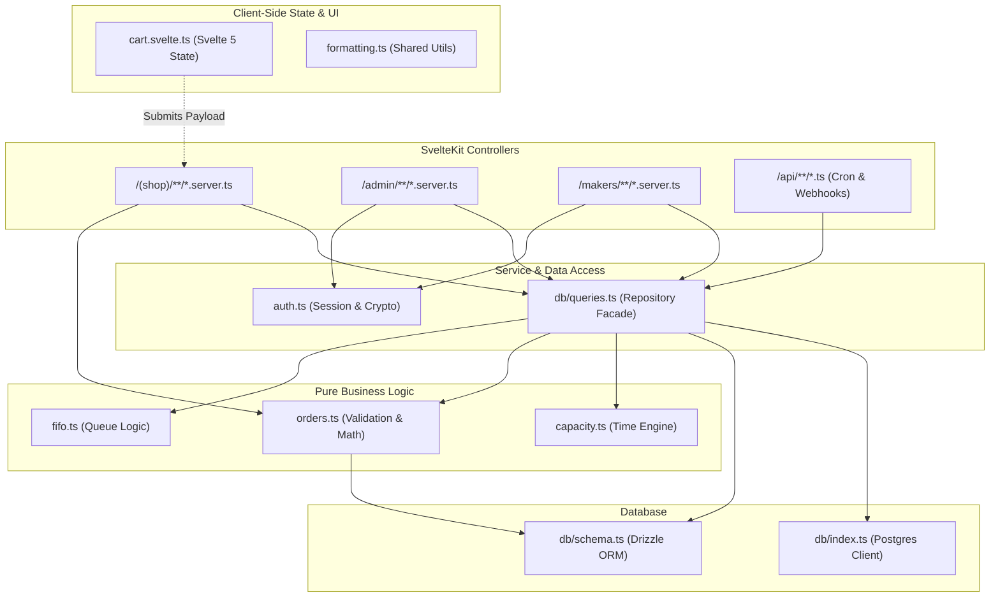

```mermaid
flowchart TD
    subgraph Client Layer [Client-Side State & UI]
        Cart["cart.svelte.ts (Svelte 5 State)"]
        Format["formatting.ts (Shared Utils)"]
    end

    subgraph Presentation Layer [SvelteKit Controllers]
        ShopRoutes["/(shop)/**/*.server.ts"]
        AdminRoutes["/admin/**/*.server.ts"]
        MakerRoutes["/makers/**/*.server.ts"]
        Webhooks["/api/**/*.ts (Cron & Webhooks)"]
    end

    subgraph Application Layer [Service & Data Access]
        Queries["db/queries.ts (Repository Facade)"]
        Auth["auth.ts (Session & Crypto)"]
    end

    subgraph Domain Layer [Pure Business Logic]
        Capacity["capacity.ts (Time Engine)"]
        Orders["orders.ts (Validation & Math)"]
        FIFO["fifo.ts (Queue Logic)"]
    end

    subgraph Infrastructure Layer [Database]
        Schema["db/schema.ts (Drizzle ORM)"]
        DB["db/index.ts (Postgres Client)"]
    end

    %% Client Dependencies
    Cart -.->|Submits Payload| ShopRoutes

    %% Presentation Dependencies
    ShopRoutes --> Queries
    ShopRoutes --> Orders
    AdminRoutes --> Queries
    AdminRoutes --> Auth
    MakerRoutes --> Queries
    MakerRoutes --> Auth
    Webhooks --> Queries

    %% Application Dependencies
    Queries --> DB
    Queries --> Schema
    Queries --> Capacity
    Queries --> Orders
    Queries --> FIFO

    %% Domain Dependencies
    Orders --> Schema
```