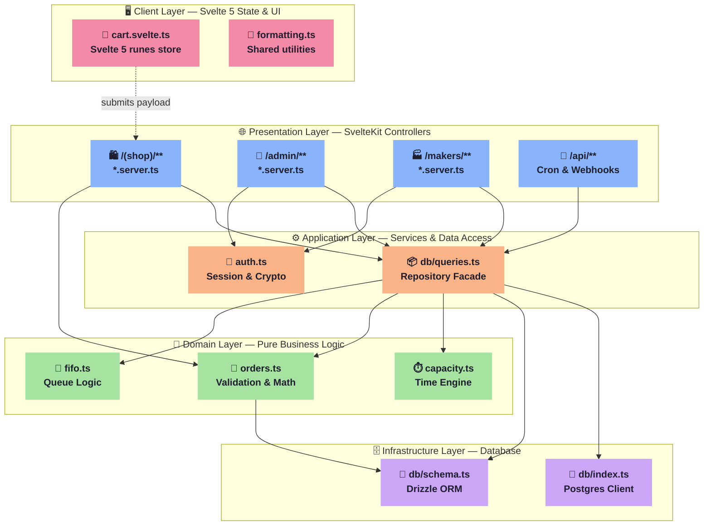

```mermaid
%%{init: {
  "theme": "base",
  "themeVariables": {
    "primaryColor": "#1e1e2e",
    "primaryTextColor": "#cdd6f4",
    "lineColor": "#6c7086",
    "clusterBkg": "#181825",
    "clusterBorder": "#313244",
    "titleColor": "#cdd6f4",
    "edgeLabelBackground": "#313244",
  }
}}%%
flowchart TD

    subgraph Client["🖥️  Client Layer — Svelte 5 State & UI"]
        Cart["🛒 cart.svelte.ts\nSvelte 5 runes store"]:::clientNode
        Format["🔧 formatting.ts\nShared utilities"]:::clientNode
    end

    subgraph Presentation["🌐  Presentation Layer — SvelteKit Controllers"]
        ShopRoutes["🛍️ /(shop)/**\n*.server.ts"]:::presentNode
        AdminRoutes["🔑 /admin/**\n*.server.ts"]:::presentNode
        MakerRoutes["🏭 /makers/**\n*.server.ts"]:::presentNode
        Webhooks["🔔 /api/**\nCron & Webhooks"]:::presentNode
    end

    subgraph Application["⚙️  Application Layer — Services & Data Access"]
        Queries["📦 db/queries.ts\nRepository Facade"]:::appNode
        Auth["🔐 auth.ts\nSession & Crypto"]:::appNode
    end

    subgraph Domain["🧠  Domain Layer — Pure Business Logic"]
        Capacity["⏱️ capacity.ts\nTime Engine"]:::domainNode
        Orders["🧮 orders.ts\nValidation & Math"]:::domainNode
        FIFO["🔢 fifo.ts\nQueue Logic"]:::domainNode
    end

    subgraph Infra["🗄️  Infrastructure Layer — Database"]
        Schema["📐 db/schema.ts\nDrizzle ORM"]:::infraNode
        DB["🐘 db/index.ts\nPostgres Client"]:::infraNode
    end

    %% Client → Presentation
    Cart -.->|"submits payload"| ShopRoutes

    %% Presentation → Application
    ShopRoutes --> Queries
    ShopRoutes --> Orders
    AdminRoutes --> Queries
    AdminRoutes --> Auth
    MakerRoutes --> Queries
    MakerRoutes --> Auth
    Webhooks --> Queries

    %% Application → Domain + Infra
    Queries --> DB
    Queries --> Schema
    Queries --> Capacity
    Queries --> Orders
    Queries --> FIFO

    %% Domain → Infra
    Orders --> Schema

    classDef clientNode   fill:#f38ba8,color:#1e1e2e,stroke:#f38ba8,font-weight:bold
    classDef presentNode  fill:#89b4fa,color:#1e1e2e,stroke:#89b4fa,font-weight:bold
    classDef appNode      fill:#fab387,color:#1e1e2e,stroke:#fab387,font-weight:bold
    classDef domainNode   fill:#a6e3a1,color:#1e1e2e,stroke:#a6e3a1,font-weight:bold
    classDef infraNode    fill:#cba6f7,color:#1e1e2e,stroke:#cba6f7,font-weight:bold
```