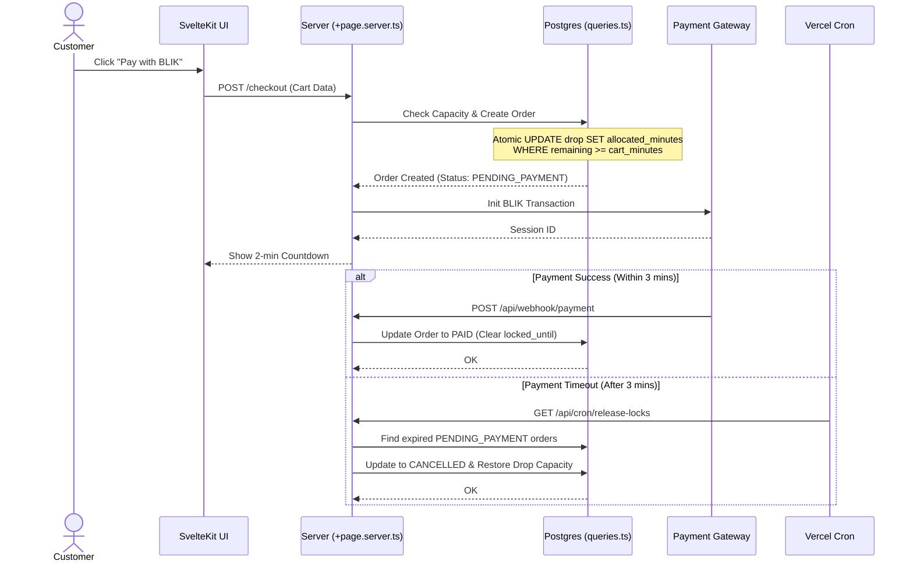

```mermaid
sequenceDiagram
    actor Customer
    participant UI as SvelteKit UI
    participant API as Server (+page.server.ts)
    participant DB as Postgres (queries.ts)
    participant PayU as Payment Gateway
    participant Cron as Vercel Cron

    Customer->>UI: Click "Pay with BLIK"
    UI->>API: POST /checkout (Cart Data)
    
    API->>DB: Check Capacity & Create Order
    Note over DB: Atomic UPDATE drop SET allocated_minutes<br/>WHERE remaining >= cart_minutes
    DB-->>API: Order Created (Status: PENDING_PAYMENT)
    
    API->>PayU: Init BLIK Transaction
    PayU-->>API: Session ID
    API-->>UI: Show 2-min Countdown
    
    alt Payment Success (Within 3 mins)
        PayU->>API: POST /api/webhook/payment
        API->>DB: Update Order to PAID (Clear locked_until)
        DB-->>API: OK
    else Payment Timeout (After 3 mins)
        Cron->>API: GET /api/cron/release-locks
        API->>DB: Find expired PENDING_PAYMENT orders
        API->>DB: Update to CANCELLED & Restore Drop Capacity
        DB-->>API: OK
    end
```