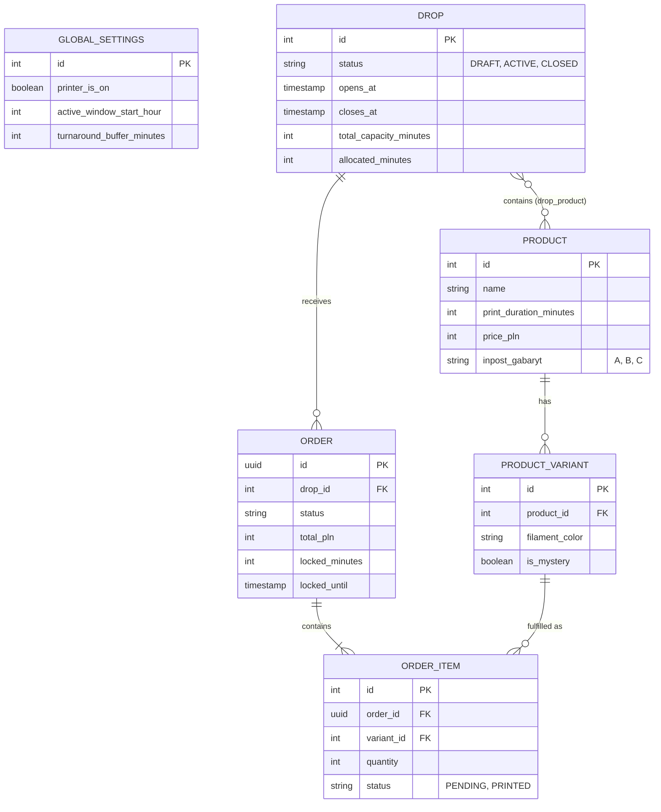

```mermaid
erDiagram
    GLOBAL_SETTINGS {
        int id PK
        boolean printer_is_on
        int active_window_start_hour
        int turnaround_buffer_minutes
    }

    DROP {
        int id PK
        string status "DRAFT, ACTIVE, CLOSED"
        timestamp opens_at
        timestamp closes_at
        int total_capacity_minutes
        int allocated_minutes
    }

    PRODUCT {
        int id PK
        string name
        int print_duration_minutes
        int price_pln
        string inpost_gabaryt "A, B, C"
    }

    PRODUCT_VARIANT {
        int id PK
        int product_id FK
        string filament_color
        boolean is_mystery
    }

    ORDER {
        uuid id PK
        int drop_id FK
        string status
        int total_pln
        int locked_minutes
        timestamp locked_until
    }

    ORDER_ITEM {
        int id PK
        uuid order_id FK
        int variant_id FK
        int quantity
        string status "PENDING, PRINTED"
    }

    DROP ||--o{ ORDER : "receives"
    DROP }o--o{ PRODUCT : "contains (drop_product)"
    PRODUCT ||--o{ PRODUCT_VARIANT : "has"
    ORDER ||--|{ ORDER_ITEM : "contains"
    PRODUCT_VARIANT ||--o{ ORDER_ITEM : "fulfilled as"
```
