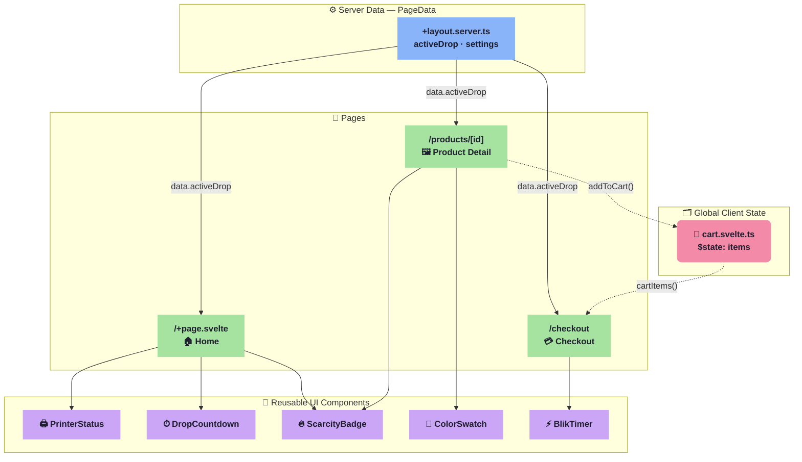

```mermaid
%%{init: {
  "theme": "base",
  "themeVariables": {
    "primaryColor": "#1e1e2e",
    "primaryTextColor": "#cdd6f4",
    "primaryBorderColor": "#89b4fa",
    "lineColor": "#89b4fa",
    "secondaryColor": "#181825",
    "tertiaryColor": "#11111b",
    "background": "#1e1e2e",
    "mainBkg": "#1e1e2e",
    "nodeBorder": "#89b4fa",
    "clusterBkg": "#181825",
    "clusterBorder": "#45475a",
    "titleColor": "#cdd6f4",
    "edgeLabelBackground": "#313244",
  }
}}%%
flowchart TD
    subgraph GlobalClientState["🗂 Global Client State"]
        Cart["🛒 cart.svelte.ts\n$state: items"]:::storeNode
    end

    subgraph ServerData["⚙️ Server Data — PageData"]
        ShopLoad["+layout.server.ts\nactiveDrop · settings"]:::serverNode
    end

    subgraph Pages["📄 Pages"]
        Home["/+page.svelte\n🏠 Home"]:::pageNode
        PDP["/products/[id]\n🖼 Product Detail"]:::pageNode
        Checkout["/checkout\n💳 Checkout"]:::pageNode
    end

    subgraph ReusableUI["🧩 Reusable UI Components"]
        direction LR
        PrinterStatus["🖨 PrinterStatus"]:::uiNode
        DropCountdown["⏱ DropCountdown"]:::uiNode
        ScarcityBadge["🔥 ScarcityBadge"]:::uiNode
        ColorSwatch["🎨 ColorSwatch"]:::uiNode
        BlikTimer["⚡ BlikTimer"]:::uiNode
    end

    %% Server → Pages
    ShopLoad -->|"data.activeDrop"| Home
    ShopLoad -->|"data.activeDrop"| PDP
    ShopLoad -->|"data.activeDrop"| Checkout

    %% Pages → Components
    Home --> PrinterStatus
    Home --> DropCountdown
    Home --> ScarcityBadge
    PDP --> ColorSwatch
    PDP --> ScarcityBadge

    %% Cart interactions
    PDP -.->|"addToCart()"| Cart
    Cart -.->|"cartItems()"| Checkout
    Checkout --> BlikTimer

    %% Node styles
    classDef storeNode   fill:#f38ba8,color:#1e1e2e,stroke:#f38ba8,font-weight:bold,rx:8
    classDef serverNode  fill:#89b4fa,color:#1e1e2e,stroke:#89b4fa,font-weight:bold
    classDef pageNode    fill:#a6e3a1,color:#1e1e2e,stroke:#a6e3a1,font-weight:bold
    classDef uiNode      fill:#cba6f7,color:#1e1e2e,stroke:#cba6f7,font-weight:bold
```